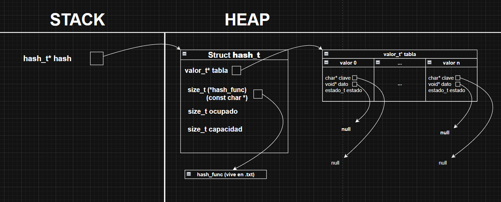
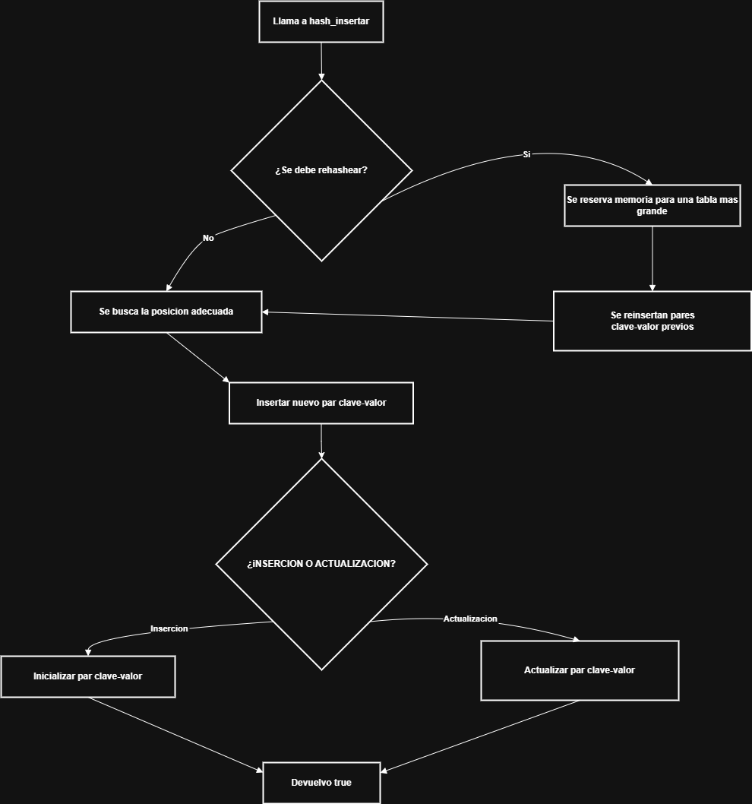
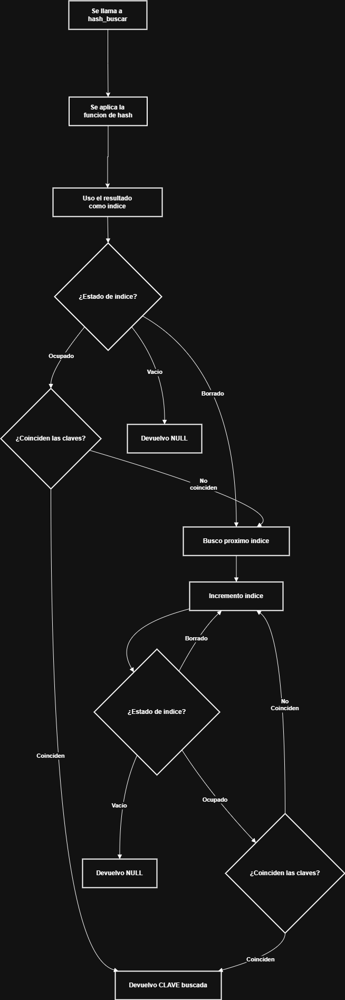
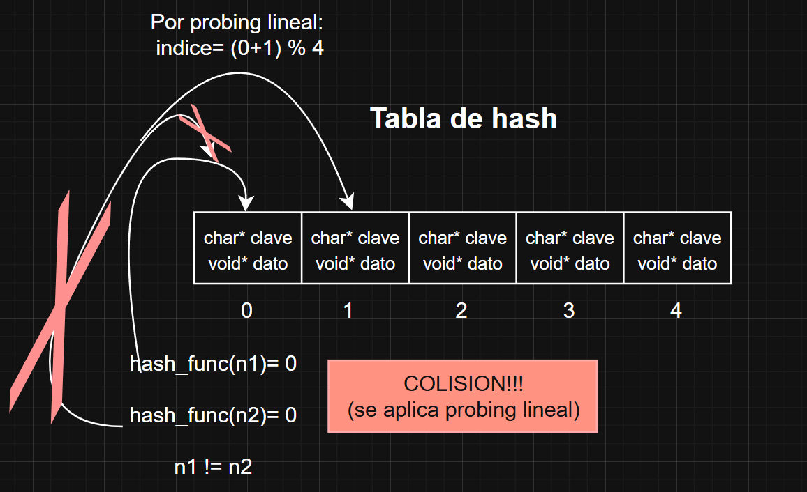
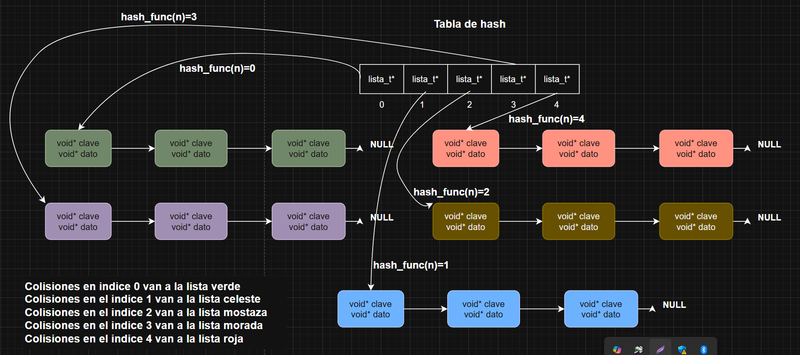

<div align="right">

</div>

# TDA HASH

## Alumno: Federico Puchetta - 112853 - fpuchetta@fi.uba.ar

- Para compilar:

```bash
make hash
./hash para ejecutar
```

- Para pruebas:

```bash
make pruebas
./pruebas para ejecutar pruebas
```
---
##  Funcionamiento

El tda hash implementado funciona mediante la estructura **hash_t** proporcionada por la catedra y las estructuras implementadas **valor_t** y **estado_t**.

Primero se debe crear el hash mediante el uso de laguna de las 2 funciones ``hash_crear`` o ``hash_crear_con_funcion``.

Luego se pueden insetar pares clave valor, a la vez que realizar busquedas de datos mediante las claves, la eliminacion de datos o la iteracion por claves en la tabla.

El manejo de memoria de las claves proporcionadas por el usuario luego de la insercion de las mismas queda a disposicion de dicho usuario. El TDA funcionara correctamente.

## Opciones de diseño

En primer instancia la estructura ``hash_t`` proporcionada por la catedra se implementa con la adicion de un contador de elementos actuales y una capacidad maxima, a su vez, se guarda la funcion de hash asociada a la tabla y un vector del tipo **valor_t** para utilizar como tabla de hash.

En este caso se decidio implementar la nueva estructura para poder almacenar en la tabla elementos del tipo ``valor_t`` el cual sera el encargado de almacenar las pares clave-valor de la tabla de hash y el estado de dicho elemento.

Dicho estado es implementado mediante la estructura ``estado_t`` el cual enumera los 3 posibles estados de un elemento en la tabla, que este ocupado, que este vacio o que haya sido borrado previamente

#### Enum de busqueda

Por ultimo, se opto por crear un segundo enum sin estructurar encarga de enumerar los dos posibles casos de busqueda de una posicion dentro del vector de la tabla de hash, los cuales pueden ser **busqueda pura** o **busqueda de insercion**. De esta forma, me permite una mejor modularizacion en el las funciones primitivas ya que solo dependo de una unica funcion de busqueda de posiciones.

## Analisis de complejidad

La idea de implementar un diccionario utilizando una tabla de hash es la busqueda de primitivas que poseean complejidades lo mas parecidas a ``O(1)``.

### hash_crear y hash_crear_con_funcion:

Ambas funciones se encargan de inicializar y reservar memoria para la estructura de hash, por lo cual sus complejidades son consantes. **O(1)**

Una vez usadas, la distribucion de memoria puede verse de la siguiente forma:

<div align="center">

</div>

---

### hash_insertar:

La funcion de insercion en la tabla de hash, consta de una complejidad constante en la gran mayoria de casos gracias a la funcion de hash.

Aun habiendo colisiones, al tener probing lineal para buscar la posicion libre de insercion, la iteracion no se extiende a la totalidad de los elementos del vector, por lo cual se considera cercana a una complejidad constante.

Sin embargo existen casos en los que la complejidad es lineal debido al rehash.

El rehash se encarga de reservar una memoria nueva para la tabla en caso de que una insercion a realizar aumente el factor de carga y  haya superado el factor de carga maximo. Luego, al reinsertar todos los elementos se realizan **N veces, una operacion constante** por lo cual, la insercion en el peor de los casos es **O(n)**.

El siguiente diagrama puede mostrar los pases que se siguen a la hora de insertar un par clave-valor en la tabla:

<div align="center">

</div>

---

### hash_buscar:

La funcion encargada de la busqueda presenta una complejidad constante debido a la funcion de hasheo la cual siempre devolvera la posicion mas cercana al par buscado, o la posicion propia del par buscado.

De esta forma, se puede decir que la complejidad es **O(1)**.

El flujo de una busqueda puede verse asi:
<div align="center">

</div>

### hash_sacar:

Al igual que las funciones de busqueda e insercion, la complejidad de sacar un par clave-valor de la tabla de hash se torna constante debido a la facilidad que nos provee limitar el tamaño de la tabla y utilizar la funcion de hash.

---

De esta forma, podemos decir que la complejidad es **O(1)**.

---

### hash_existe y hash_tamanio:

Las complejidades de dichas funciones son constantes gracias al campo del TDA **ocupado** por parte de hash_tamanio, y para hash_existe, gracias a la funcionalidad que se busca de un hash la cual es la funcion de hash.

De esta forma, se puede decir que las complejidades de ambas funciones son **O(n)**.

---

### hash_destruir y hash_destruir_todo:

Ambas funciones encargas de destruir el TDA en si, tienen una complejida de **O(n)**, siendo N la cantidad de pares insertados en la tabla. Se deben recorrer n elementos y para cada una realizar una accion constante.

### hash_iterar_claves:

La funcion encargada de iterar el hash en si, tambien posee una complejidad lineal, debido a que en el peor de los casos se deben recorrer todos los elementos insertados en la tabla y para cada una hacer una accion que tendra complejidad respecto a la funcion pasada por parametro.

Aun asi, la complejidad de dicha funcion no afecta a nuestro analisis debido a que se encarga de realizarla en cada valor_t, por lo cual para el tamaño de nuestro problema dado por el tamaño de la tabla, resulta insignificante.

De esta forma, se puede decir que la complejidad de la funcion es **O(n)**.

---

## Respuestas a las preguntas teóricas

### Qué es un diccionario - Explicar 3 formas diferentes de implementar un diccionario (tabla de hash cuenta como 1). Justificar ventajas y desventajas.

Un diccionario es un TDA el cual busca guardar pares asociados de clave-valor. Dependiendo de la forma de implementarlo, se pueden permitir copias de claves o no.

Un diccionario puede implementarse de diversas formas, en este caso hablaremos de **diccionario como lista enlazada**, **diccionario como tabla de hash** y **diccionario como abb balanceado**

#### Diccionario como lista hash:

En primer instancia, un diccionario como tabla de hash consta de una tabla para guardar pares de clave-valor y una funcion de hash la cual provee un numero entre el limite maximo de la tabla.

Esta forma de implementar un diccionario es util debido a su velocidad en acceso a los datos, llegando a ser en la gran mayoria de veces constante gracias a la funcion de hash.
Tambien se puede decir que es escalable debido a que simplemente se puede aumentar el tamaño de la lista y permitir mayor insercion de pares.

Aun asi, este tipo de implementacion posee algunas desventajas en comparacion de las otras dos.
A la hora de utilizar la funcion de hash, se pueden dar **colisiones** si dos claves distintas dan el mismo valor. Esto genera que la busqueda no sea estrictamente O(1) ya que puede tener que realizarse una insercion en un lugar cercano a la posicion dada.

A su vez, las tablas deben ser creadas con una capacidad maxima, por lo cual esto puede generar un gran uso de memoria si la tabla es demasiado grande, y tampoco se mantiene un orden de insercion predefinido.

---

#### Diccionario como lista enlazada:

Los diccionarios como listas enlazadas guardan pares clave-valor en una lista enlazada guardando en cada nodo dicho par.

Las ventajas de esta implementacion es su facil creacion debido a que no es necesario crear una funcion de hash de acuerdo al problema. A su vez, se mantiene un uso eficiente de memoria debido a que solo se reserva memoria para cada nodo que contenga cada par, sin necesidad de crear reservar un tamaño maximo.

Por otro lado, las desventajas de dicha implementacion es la complejidad de las funciones de busqueda insercion o eliminacion, ya que adoptan las complejidades de las primitivas de una lista enlazada, es decir O(n) en la mayoria.

A su vez, al igual que en un hash, no se mantiene un orden de insercion.

---

#### Diccionario como abb balanceado:

En un diccionario implementado como un abb balanceado, ya sea AVL o Arbol Rojo-Negro hay algunas mejoras en funcion de la implementacion mediante una lista enlazada pero no llegan a ser mejores que las del hash.

Estas mejoras en base a la lista enlazada se basan en la complejidad de las primitivas de este TDA, debido a que adoptan las complejidades de las primitivas de un ABB balanceado, ya que serian logaritmicas. A su vez, la memoria utilizada es similar al caso de la lista ya que solo se reserva memoria para cada nodo a insertar. Tambien se posee un orden de insercion predefinido, por lo cual la busqueda de elementos tambien se podria dar en orden como la iteracion de dichos elementos.

Aun asi, esta implementacion tambien posee sus desventajas, como por ejemplo el costo de mantener balanceado dicho arbol al momento de insertar o eliminar pares. El acceso a claves es logaritmico pero no se asemeja al acceso constante de un hash, lo cual puede ser perjudicial en abb con muchos pares.

---

### Qué es una función de hash y qué características debe tener para nuestro problema en particular

Una funcion de hash es un algoritmo que transforma claves proporcionadas en entrada a un valor numerico dentro del tamaño de una tabla predefinida.

El proposito de esta tabla es permitir el rapido acceso a elementos mediante la clave de entrada.

Es por esto, que en general a una funcion de hash se le pide que sea **Deterministica**, lo cual significa que para una entrada siempre devuelve la misma salida, **eficiente o lenta** para una veloz insercion u obtencion de datos o su version lenta en base al problema a resolver, a su vez que **Uniforme** lo cual se pide para tratar de evitar la mayor cantidad de colisiones posibles.

En nuestro caso en especifico, la funcion de hash debe ser **rapida** y **uniforme** para poder lograr una insercion u obtencion de datos veloz, a la vez que poder evitar la mayor cantidad de colisiones de pares clave-valor. Esto permite a su vez que la operacion de rehash se realice de la forma mas rapida posible la cual es la operacion mas costosa de una insercion en un diccionario.

---

### Qué es una tabla de Hash y los diferentes métodos de resolución de colisiones vistos.

Una tabla de hash es un TDA que almacena pares de clave-valor, esta relacionado a una funcion de hash encargada de encontrar la posicion de cada clave dentro de una tabla (vector dinamico). Esta estructura busca poder realizar operaciones cercanas a constantes (O(1)) en base a los pares guardados. Esto es permitido debido a la funcion de hash.

Aun asi, la implementacion de dicha tabla como un vector dinamico provee una limitacion en funcion de los lugares disponibles. La funcion de hash va a devolver posiciones en el vector que ya esten ocupadas con otra clave, lo cual genera una **colision**.

Estas colisiones pueden resolverse de dos formas vistas: **direccionamiento abierto** o **direccionamiento cerrado**

Por un lado, el direccionamiento abierto es una forma de resolucion de colisiones la cual deja en claro que **no se asegura que el par clave-valor este en el lugar proporcionado por la funcion de hash** se basa en buscar una siguiente posicion disponible en funcion de un **probing** elegido previamente, el cual puede ser lineal o cuadratico, o de otras formas. Asi, se logra resolver las colisiones permitiendo la insercion de elementos en lugares vacios del array.

Un hash con direccionamiento abierto puede verse asi (con probing lineal):

<div align="center">

</div>

Por otro lado, el direccionamiento cerrado es una forma de resolucion de colisiones la cual deja en claro que **el par clave valor estara en el indice dado por la funcion de hash**. De esta forma, lo que se hace con este direccionamiento es guardar en cada indice de la tabla (Vector), un puntero a una estructura elegido, la cual puede ser otro hash, una lista, un abb, etc. Asi, las colisiones iran a parar a dicho indice, para luego insertarse en la estructura apuntada por dicho indice, logrando "agrupar" las colisiones y permitir insertar elementos aun habiendo dado el mismo indice.

Para mantener este tipo de direccionamiento, se debe reescalar la tabla en caso de que las estructuras apuntadas superen la cantidad de elementos de la misma.

Un hash con direccionamiento cerrado puede verse asi (con lista):

<div align="center">

</div>

--- 
### Explicar por qué es importante el tamaño de la tabla (tanto para tablas abiertas como cerradas). Dado que en una tabla abierta se pueden encadenar colisiones sin importar el tamaño de la tabla, ¿Realmente importa el tamaño?

El tamaño de una tabla de hash es importante tanto como en el desarrollo de un hash cerrado tanto como en el de un hash abierto. 

Por un lado, en el caso de una hash cerrado, el tamaño de la tabla define cuantas direcciones posibles hay. De esta forma, con una tabla de mayor tamaño es probable que se tengan menos colisiones o que la insercion de un elemento no se asemeje a O(n) debido a que aumentaria la posibilidad de encontrar un lugar vacio.

Por otro lado, en el caso de un hash abierto, el tamaño de la tabla es decisivo para la complejidad de las primitivas del mismo. Si dejamos fijo el tamaño de la tabla, en dicho caso las colisiones no serian un problema debido a que simplemente se encadenarian una tras otra en el TDA propuesto del indice de la tabla. Aun asi, el problema no surge por las colisiones mismas, sino por el aumento de complejidad de operaciones como la busqueda de elementos.

Por ejemplo, en el caso de optar por implementar un hash abierto con una lista, si dejamos el tamaño de la tabla fijo, las colisiones se encadenarian en cada lista respecto a cada indice de la tabla, logrando que en un determinado punto la lista sobrepase excesivamente el tamaño de la tabla complejizando aun mas la busqueda de elementos hasta llevarla a un O(n) (complejidad de buscar en una lista).

De esta forma, si aumentamos el tamaño de la tabla de forma medida cuando se sobrepase la cantidad de elementos de uno de los indices, lograremos acercar la complejidad de las primitivas a un O(1) ya que la longitud de las listas propias no sera superior al largo de la tabla, y la funcion de hash nos proporcionaria un acercamiento al valor a encontrar.


